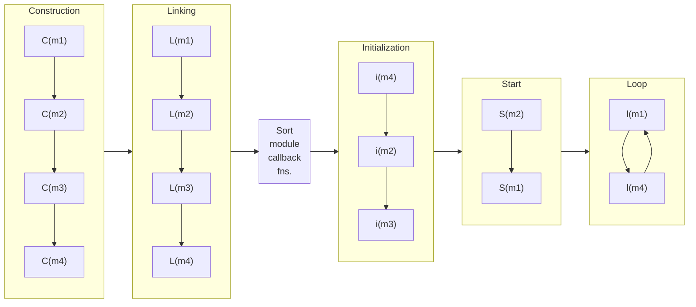

## Modules and the ModuleSystem

### Modules

The `og3` library allows application to be built as arrangements of interdependent [`Module`s](../include/og3/module.h).  Modules are units of code that perform a specific function, and which have a defined life-cycle.

Here is an example Arduino program which blinks an LED connected to an output pin:
```C++
void setup() { pinMode(kLEDPin, OUTPUT); }
void loop() {
    static bool s_previous = true;
    const bool output = ((millis() / 1000) % 2) == 1;
    if (s_previous != output) {
        digitalWrite(kLEDPin, output ? HIGH : LOW);
        s_previous = output;
    }
}
```

Here is the same program, but written using a module to do the work of blinking the LED.  This example uses some facilities of `og3` including an [`App`](apps.md) and [scheduled tasks](scheduled-tasks.md).  The `App` contains a `ModuleSystem` which will be described below, and the `Tasks` object (really another module) used for running callback functions at scheduled times.
```C++
namespace {

og3::App s_app(og3::App::Options().withLogType(og3::App::LogType::kSerial));

class Blink : public og3::Module {
 public:
  explicit Blink(og3::App* app) : og3::Module("blink", &app->module_system()), m_app(app) {
    add_init_fn([this]() { pinMode(kLEDPin, OUTPUT); });
    add_start_fn([this]() { blink(); });
  }
  void blink() {
    digitalWrite(kLEDPin, m_high ? HIGH : LOW);
    m_high = !m_high;
    m_app->tasks().runIn(1000, [this]() { blink(); });
  }

 private:
  og3::App* m_app;
  bool m_high = false;
};

Blink s_blink(&s_app);

}  // namespace

void setup() { s_app.setup(); }
void loop() { s_app.loop(); }
```
For this simple example, the module-based version is longer and more complicated.  However, it would be easy to put the `Blink` class in a separate reusable file, and add it with the single line `Blink s_blink(&s_app)` in the main application file.  It is automatically started and run by the `App` in via the `setup()` and `loop()` methods.  Any number of modules could be added to the application in the same way, and this enables a complicated application to be built from simpler components.

Components can use other components.  For example, a web-server component or MQTT component could depend on a Wifi component to manage the wifi connection it needs.  Modules can get pointers to one another for this purpose, and they can declare dependencies on one another to ensure they are initialized in an order which will work.  The [`ModuleSystem`](../include/og3/module_system.h) is the object which organizes the modules: it helps them obtain pointers to one another by name, manages their dependencies, and manages their execution.

### ModuleSystem and the Module life-cycle

For a given module, its life-cycle looks like:

1. **Construction**. Each module is constructed and registered with the `ModuleSystem` using a unique name.  Any callback functions to be called by the `ModuleSystem` during the later stages of the lifecycle listed below (Initialization, Start, and Update) are registered with the `ModuleSystem` during construction.  A module may register more than one of these callbacks can be registered for a given lifecycle stage.
2. **Linking**.  The module is passed a mapping for all modules of the module so that it can grab pointers to any modules it wants.  These pointers can be used to:
    * Declare to the `ModuleSystem` which modules this module depends on.  The `ModuleSystem` will sort modules so that during the Initialization, Start, and Update steps below, modules are processed after all modules they depend on.  If declared dependencies are circular, this will be detected and an error reported
    * Use the pointers to collaborate with other modules by getting information from them, passing information to them, or giving them commands.
3. **Sorting module callbacks**.  Callbacks registered by each module for the Initialization, Start, and Update steps are sorted by the `ModuleSystem`.  Within each life-cycle phase, functions for a given module will be called after those for all modules it depends on (a "topological sort").  If more than one function for a given phase is registered by a given module, these will be called in the order in which they were registered with the `ModuleSystem.
4. **Initialization**.  The `init()` functions registered with the `ModuleSystem` are called in topologically-sorted order.  Modules may want to do things like set hardware pins to input or output mode, allocate memory, or setup data structures.
5. **Start**.  The `start()` functions registered with the `ModuleSystem` are called in topologically-sorted order.  Modules may want to do things like schedule timed tasks to run in the future, set outputs, read initial values of inputs, and start network operations.
6. **Update**.  After all the above steps have run to set up the application, the main work of the application is performed by repeatedly looping through the `update()` callback functions registered by each module.  These callbacks are are called in topologically-sorted order.  The update loop will be repeated until the application ends (e.g., the microcontroller is powered off).

### Example

Given 4 modules, m1, m2, m3, and m4 with dependencies:
- m1: depends on modules m2, and m4,
- m3: depends on m2, and
- m2: depends on m4,

then one possible sorted order for these modules is: m4, m2, m1, m3

If during construction of the modules:
- m1: registers `start()` and `loop()` callback with the depend system,
- m2: registers `init()` and `start()` callbacks,
- m3: registers an `init()` callback, and
- m4: registers `init()` and `loop()` callbacks,

then the lifecycle of the application would look like like this:


